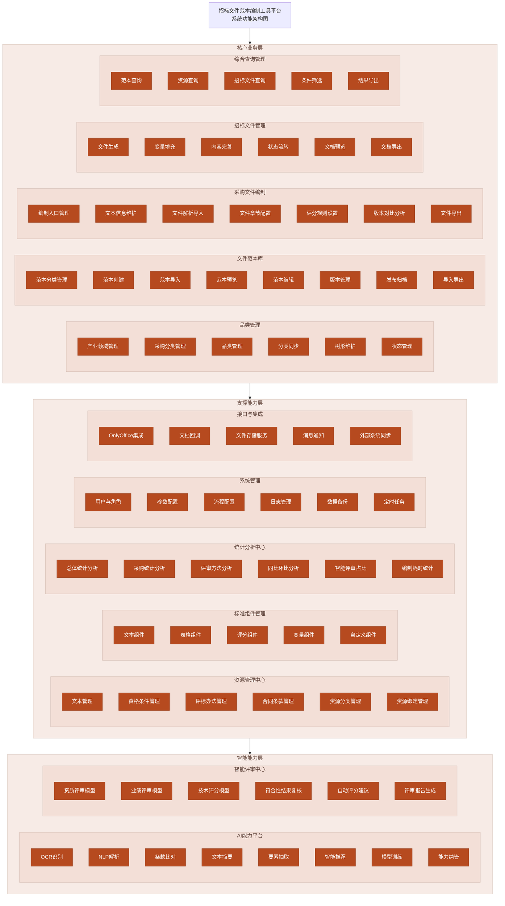

# 系统功能架构图（Mermaid）

```mermaid
flowchart TB
  T["招标文件范本编制工具平台<br/>系统功能架构图"]

  subgraph L1["核心业务层"]
    direction LR
    subgraph A["品类管理"]
      A1["产业领域管理"]
      A2["采购分类管理"]
      A3["品类管理"]
      A4["分类同步"]
      A5["树形维护"]
      A6["状态管理"]
    end
    subgraph B["文件范本库"]
      B1["范本分类管理"]
      B2["范本创建"]
      B3["范本导入"]
      B4["范本预览"]
      B5["范本编辑"]
      B6["版本管理"]
      B7["发布归档"]
      B8["导入导出"]
    end
    subgraph C["采购文件编制"]
      C1["编制入口管理"]
      C2["文本信息维护"]
      C3["文件解析导入"]
      C4["文件章节配置"]
      C5["评分规则设置"]
      C6["版本对比分析"]
      C7["文件导出"]
    end
    subgraph D["招标文件管理"]
      D1["文件生成"]
      D2["变量填充"]
      D3["内容完善"]
      D4["状态流转"]
      D5["文档预览"]
      D6["文档导出"]
    end
    subgraph E["综合查询管理"]
      E1["范本查询"]
      E2["资源查询"]
      E3["招标文件查询"]
      E4["条件筛选"]
      E5["结果导出"]
    end
  end

  subgraph L2["支撑能力层"]
    direction LR
    subgraph F["资源管理中心"]
      F1["文本管理"]
      F2["资格条件管理"]
      F3["评标办法管理"]
      F4["合同条款管理"]
      F5["资源分类管理"]
      F6["资源绑定管理"]
    end
    subgraph G["标准组件管理"]
      G1["文本组件"]
      G2["表格组件"]
      G3["评分组件"]
      G4["变量组件"]
      G5["自定义组件"]
    end
    subgraph H["统计分析中心"]
      H1["总体统计分析"]
      H2["采购统计分析"]
      H3["评审方法分析"]
      H4["同比环比分析"]
      H5["智能评审占比"]
      H6["编制耗时统计"]
    end
    subgraph I["系统管理"]
      I1["用户与角色"]
      I2["参数配置"]
      I3["流程配置"]
      I4["日志管理"]
      I5["数据备份"]
      I6["定时任务"]
    end
    subgraph J["接口与集成"]
      J1["OnlyOffice集成"]
      J2["文档回调"]
      J3["文件存储服务"]
      J4["消息通知"]
      J5["外部系统同步"]
    end
  end

  subgraph L3["智能能力层"]
    direction LR
    subgraph K["AI能力平台"]
      K1["OCR识别"]
      K2["NLP解析"]
      K3["条款比对"]
      K4["文本摘要"]
      K5["要素抽取"]
      K6["智能推荐"]
      K7["模型训练"]
      K8["能力纳管"]
    end
    subgraph M["智能评审中心"]
      M1["资质评审模型"]
      M2["业绩评审模型"]
      M3["技术评分模型"]
      M4["符合性结果复核"]
      M5["自动评分建议"]
      M6["评审报告生成"]
    end
  end

  T --> L1
  L1 --> L2
  L2 --> L3

  classDef layer fill:#f7ebe6,stroke:#d9c8bf,stroke-width:1px,color:#6b4f45;
  classDef module fill:#f3dfd7,stroke:#d0b8ae,stroke-width:1px,color:#5a3f36;
  classDef item fill:#b64a1f,stroke:#963915,stroke-width:1px,color:#ffffff;

  class L1,L2,L3 layer;
  class A,B,C,D,E,F,G,H,I,J,K,M module;
  class A1,A2,A3,A4,A5,A6,B1,B2,B3,B4,B5,B6,B7,B8,C1,C2,C3,C4,C5,C6,C7,D1,D2,D3,D4,D5,D6,E1,E2,E3,E4,E5,F1,F2,F3,F4,F5,F6,G1,G2,G3,G4,G5,H1,H2,H3,H4,H5,H6,I1,I2,I3,I4,I5,I6,J1,J2,J3,J4,J5,K1,K2,K3,K4,K5,K6,K7,K8,M1,M2,M3,M4,M5,M6 item;
```
