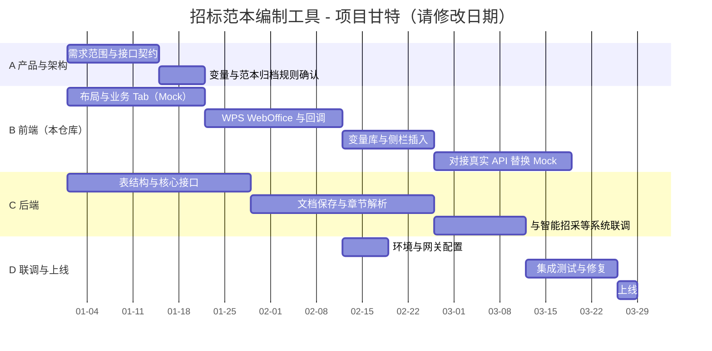

# 招标文件范本编制工具 — 项目甘特（模板）

> **说明**：下列「计划开始 / 计划结束」留空，由你自行填写；状态可按实际勾选。  
> 当前仓库为 **Next.js 前端 + Mock**，与你们文档里 **OnlyOffice/后端** 并行时可拆成两条泳道。

---

## 一、泳道总览（复制到 Excel / 飞书多维表格）

| 泳道 | 阶段摘要 |
|------|-----------|
| **A. 产品与架构** | 需求冻结、信息架构、接口契约 |
| **B. 前端（本仓库）** | 布局、各 Tab 页面、WPS WebOffice、变量与插入 |
| **C. 后端 / 服务** | 表结构、回调入库、文档解析、与前端联调 |
| **D. 联调与交付** | 环境、隧道/网关、测试、上线 |

---

## 二、任务明细表（时间由你填写）

| ID | 泳道 | 阶段 | 任务项 | 交付物/备注 | 计划开始 | 计划结束 | 状态 | 负责人 |
|----|------|------|--------|-------------|----------|----------|------|--------|
| A01 | A | 需求与设计 | 业务闭环（品类→框架→文本→范本→编辑→招标文件）范围确认 | PRD 对齐 | | | | |
| A02 | A | 需求与设计 | 变量占位符规范（`{{xxx}}`）、归档范本规则 | 与现有 CLAUDE / PRD 一致 | | | | |
| A03 | A | 需求与设计 | 前后端接口清单（REST / 回调路径） | OpenAPI 或表格 | | | | |
| B01 | B | 基础框架 | 工程搭建：Next App Router、布局、导航 Tab | 当前 MainLayout | | | | |
| B02 | B | 基础框架 | 类型定义 `src/types`、Mock 数据策略 | 已部分完成 | | | | |
| B03 | B | 业务页面 | 品类 / 框架 / 文本 / 范本 / 招标文件 页面与交互 | Mock 流转 | | | | |
| B04 | B | 范本编辑 | 金山 WPS WebOffice：JSSDK、weboffice-init、`/v3/3rd` 回调 | 回调调试通过 | | | | |
| B05 | B | 范本编辑 | 资源侧栏插入、变量库（通用型 + 自定义）、插入逻辑 | Application API | | | | |
| B06 | B | 导出与解析 | 服务端导出 HTML / 章节解析（与后端对齐后替换真实接口） | export-html 等 | | | | |
| C01 | C | 后端基础 | 表结构设计与评审 | ER 图 | | | | |
| C02 | C | 后端基础 | 文档保存回调：入库、区分新增/保存 | 接口可用 | | | | |
| C03 | C | 文档能力 | 章节/目录、占位符与 OpenXML 替换链路 | 与前端约定格式 | | | | |
| C04 | C | 文档能力 | 图片、内容控件等边界（参考你们 OnlyOffice/WPS 既有方案） | | | | | |
| C05 | C | 集成 | 品类等接口与智能招采系统同步 | | | | | |
| D01 | D | 环境 | 开发/测试/生产环境与密钥管理 | `.env` 规范 | | | | |
| D02 | D | 环境 | 公网回调：Tunnel / 正式域名、WPS 控制台网关 | | | | | |
| D03 | D | 质量 | 核心路径测试（编辑→保存→变量→招标文件） | 用例表 | | | | |
| D04 | D | 上线 | 发布 checklist、回滚策略 | | | | | |

**状态建议**：未开始 / 进行中 / 已完成 / 阻塞  

---

## 三、按业务 6 步闭环对齐的里程碑（填日期）

| 里程碑 | 含义 | 目标完成日 |
|--------|------|------------|
| M1 | 品类→框架→文本 Mock 全流程可走通 | |
| M2 | 范本生成与列表管理可用 | |
| M3 | 范本在线编辑（WPS）+ 回调落地（或 Mock 替代方案签字） | |
| M4 | 变量 + 招标文件填写 + 导出链路闭环 | |
| M5 | 后端持久化替换 Mock，联调通过 | |
| M6 | 预发 / 生产上线 | |

---

## 四、Mermaid 甘特图（把下面日期改成你的计划）

在支持 Mermaid 的文档（Notion、GitHub、飞书部分版本）中可直接渲染。  
将 `2026-01-01` 等替换为你的真实起始日与周期。

> 若任务 **并行**（例如 B 与 C 同时起步），把 `after xxx` 改成与 A/B 同日起：`task, 2026-01-01, 10d`。

---

## 五、与当前代码仓库的对应（便于排期）

| 模块 | 代码位置（参考） |
|------|------------------|
| 主布局与 Tab | `src/components/MainLayout.tsx`、`src/app/page.tsx` |
| 品类 / 框架 / 文本 / 范本 / 招标文件 | `src/components/pages/*.tsx` |
| WPS 范本编辑 | `src/components/editor/WpsTemplateEditor.tsx` |
| 回调 `/v3/3rd` | `src/app/v3/3rd/**` |
| 全局变量种子 | `src/lib/mockData.ts`（`GLOBAL_TEMPLATE_VARIABLES_SEED`） |
| 类型 | `src/types/index.ts` |

---

## 六、你们另一套后端 OnlyOffice 路线（可选并行泳道）

若与 **OnlyOffice + Java 后端** 并行排期，可复制下表单独一页，避免与「本仓库」混淆：

| ID | 任务 | 计划开始 | 计划结束 | 状态 |
|----|------|----------|----------|------|
| O01 | Docker OnlyOffice 部署与内存方案 | | | |
| O02 | 回调地址与保存验证 | | | |
| O03 | 占位符 / 微型 docx / MinIO 方案切换 | | | |
| O04 | OpenXML 替换与入库 | | | |

---

将 **第二节表格** 复制到 Excel，增加「周次」「工作日」等列即可变成完整甘特数据源；第四节的 Mermaid 适合放进周报或 README 预览。
